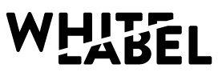

#console.log("Hello World!");

---

#Sabato 4 Maggio

 

###📍 Sellalab Biella

- Overview on Figma
- React
- Perchè fare il web developer: miti, dati e storie di coraggio

---

#Il libro della settimana è:

 

 

##The Lean Startup
by Eric Ries

<a href="https://wheelofnames.com/">🎯 Spin the Wheel!</a>

---

#Seguiteci e unitevi alle community

 

<a href="https://www.facebook.com/whitelabelcommunity/">
  whitelabelcommunity</a>

 

<a href="https://www.facebook.com/whitelabelcommunity/">
   @whitelabelcommunity</a>

 

<a href="http://whitelabel.community">
 
whitelabel.community</a>

 

<a href="https://t.me/joinchat/BOBM-xeyedgOFg0ZDqzpaA">
<i class="fab fa-telegram fa-2x"></i> 
Gruppo telegram</a>

 

<a href="https://join.slack.com/t/whitelabelcommunity/shared_invite/enQtNTg4MDUyNjY0MTE0LTA3MzQ1MzNhYmU1OGZmMDMwNGE1YWQ2YWZiNTcxZjUzZTkxZjFjMzgwN2M3ZWU2YTQ2OTY5MTdjNTZhY2JiM2E">
<i class="fab fa-slack fa-2x"></i> 
Canale slack</a>

###Se volete lasciare un feedback su questo meetup: <a href="http://feedback.whitelabel.community">feedback.whitelabel.community</a>

---

#Grazie!

