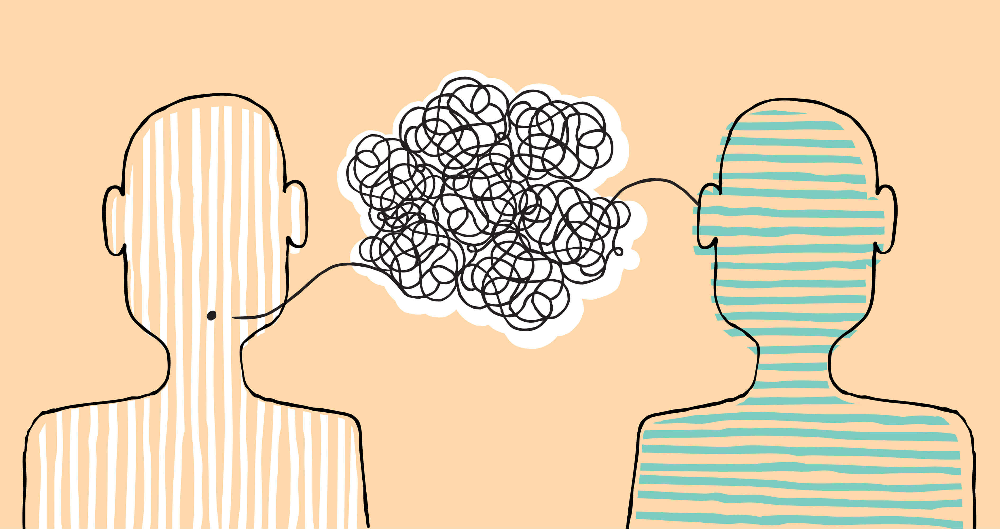
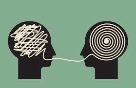
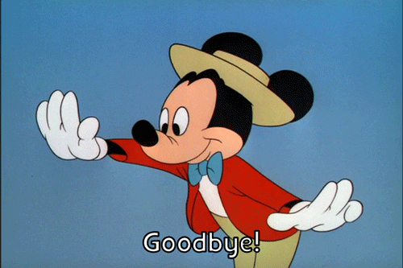

# La creatività dello sviluppatore
### lo sviluppatore è un lavoro creativo?

---

# Angelo Moroni

* Android Dev, dallo spiccato **accento romano**, in Bemind e Head of Android Team in **HYPE** dal 2015
* Amante di Kotlin
* Aspirante Scrittore, paradossale se si pensa che scrivo poca documentazione
* Pessimo Ballerino

---

## Cosa fa una sviluppatore?
### In cosa consiste il tuo lavoro?

---

**Che poi è semplice:**
# Scrivo una serie di comandi che verranno eseguiti dalla macchina

---

# Ma coma fa la macchina a comprendere?

---

**Prima di entrare nel dettaglio, rispondete a:**
# Come fate a comprendere quello che sto dicendo

**_Linguaggio Naturale_ vs _Linguaggio di Programmazione_**

---

---

**Ha senso questo parallelismo?**

# Lo Sviluppatore è un lavoro più creativo che scientifico

---

Ciò che ci confonde è l’ambiente aziendale in cui ci collochiamo e non ci mette sotto una luce artistica. **Ma quanti articoli di giornale sono considerabili vere e proprie opere d’arte?** Sono solo prodotti creativi.

---

### Come fate a comprendere ciò che vi sto dicendo?
Tra quello che sto dicendo e gli impulsi elettrici passati tra neuroni c'è una serie, non ben chiara, di traduzioni.

* Frase
* _conversione 1_
* _conversione 2_
....
* _conversione n_
* impulso elettrico

---
 *Cosa che è molto simile, per non dire uguale, a ciò che succede con il linguaggio di programmazione*
* Comando
* _conversione al linguaggio di programmazione inferiore_
...
* _conversione in linguaggio macchina_

Es. Python ha l'interprete scritto in C

---
### Come fate a comprendere ciò che vi sto dicendo?
Prima del linguaggio di programmazione, viene sviluppato il traduttore (il compilatore e/o interprete)

---
 ### Cos'è un linguaggio?
 Il linguaggio, in linguistica, è il complesso definito di suoni, gesti e movimenti attraverso il quale si attiva un processo di comunicazione.
 
 ---
 ### Cos'è un linguaggio?
Il linguaggio è un *insieme dei codici simbolici* (di natura verbale o non verbale) che permettono di trasmettere, conservare, elaborare informazioni

---
### Linguaggio di programmazione vs Linguaggio naturale

#### Programmazione

- Ha una grammatica
- Ha una sintassi
- Ha delle parole chiave
- Serve ad esprimere la soluzione ad un problema

#### L. Naturale
- Ha una grammatica
- Ha una sintassi
- Ha delle parole chiave
- Serve ad esprimere un concetto

---
# Errori

---
## Errori grammaticali

### Errori ortografici

 **fi** (cacio == formaggio) { … } 

 

Se **qeusto** coso e un **fromaggio**

 
 ### Errori sintattici

 

 if( **cacio = formaggio**) {… } 

 

**Se coso questo é formaggio un**

 

 ---

 
 ## Errori Semantici
 Gli errori semantici, cioè di significato, nei linguaggi di programmazione sono i bug, ovvero **comportamenti non previsti, dovuti alla cattiva impostazione di un testo grammaticalmente corretto**
 
 ---
 
 ## Errori Semantici: Esempio
 
 - _Amore, vai a prendermi un kg di pomodori, e se ci sono le uova prendimene 6._
- _Il marito torna con 6 kg di pomodori, perché le uova c’erano._

Ora, noi sappiamo che la donna intendesse le uova, perché il nostro traduttore è ad un livello tale da comprendere, ma non possiamo cadere dal pero se accadesse una cosa del genere.

---

### Avete mai letto un libro di filosofia?
Leggere un libro di filosofia (senza saperne nulla dell’autore) è molto simile a leggere codice di un altro sviluppatore

---

### Esempio: Alzarsi la mattina
Ci sono tanti modi per dire la stessa cosa:
 * “Aho, ammazza che giornata, sto da Dio!” 
 * "Millumino d'immenso"

---

Questo per dirvi una cosa ovvia, ma sottovalutata:
## Gli sviluppatori non sono tutti uguali

---

## La ricerca in una lista
 * Scorrere la lista, elemento per elemento
 * Ordinarla e poi andare direttamente sull'elemento

---
## Parlare d'amore

* "Ah no, cioè, me fa arrabbià, oh, che je spaccherei le gambe, ma quando la guardo, oh, te giuro, l’amo ‘nsacco oh, na cifra. Tre metri sopra il cielo, cioè."
* "Odi et amo"

---

Altra domanda, che mi fanno spesso:
## Perchè tanti linguaggi differenti?

---
## Enjoy
I linguaggi, contrariamente alle lingue, si sono sviluppati per risolvere problemi differenti: c’è quello che ha uno scopo matematico (matlab) e quello che ha uno da frontend (javascript)

Per fare un esempio: la parola Enjoy serve a definire un concetto che non ha una parola diretta in italiano.

---

# Grazie!
 * Cercatemi su Facebook: Angelo Hooloovoo Moroni
 * o Linkedin: Angelo Moroni

 
 
 
 

