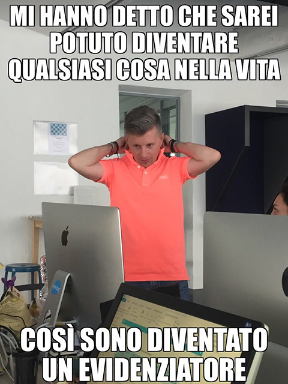
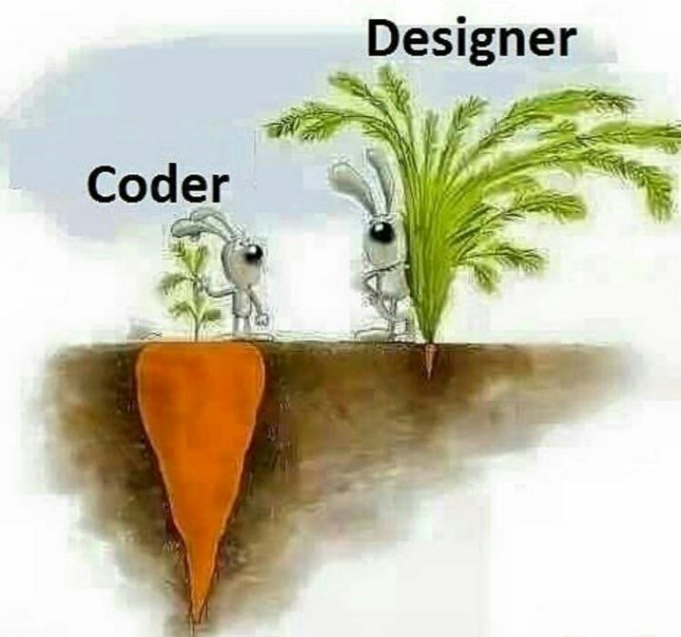

---

## Cos'è Figma?

Figma fondamentalmente è un **tool per sviluppare grafica"**.
Può essere usato per gli utilizzi più disparati: biglietti da visita, volantini, app, web design, software, vettoriali e tutto quello che si è da sempre fatto con tool come Illustrator, Sketch e altri.

---

<video controls width="90%">
    <source src="./Hero_Animation_60fps.mp4" type="video/mp4">
    Sorry, your browser doesn't support embedded videos.
</video>

---

# Il Designer

Solitamente è spacciato come una creatura estroversa e socievole, estrosa e eccentrica.
La realtà è però diversa.

Proprio a causa del lavoro in sè, solo una persona può creare un logo o un'interfaccia di un prodotto, lasciando ad altri designer un ruolo più di "critica"* che non di reale supporto o aiuto.

<small >* (si perché se date un consiglio a un designer *potrebbe succedere* che lo convertirà in critica 😃)</small>

---

# Il Developer

Sulla carta è una specie introversa, che lascia raramente la propria caverna fatta di monitor e tastiere inutilmente rumorose.
La realtà, anche in questo caso, è però diversa.

Scrivere codice, creare prodotti oggi segue un approccio più "collaborativo". Sono proliferati siti come Github, Stackoverflow, Codepen o altri che hanno permesso a chi sviluppa di aprirsi all'esterno, sia condividendo il proprio materiale che aiutando altri sviluppatori.

E alcuni sono proprio fuori di testa! 😬

---

---

## Designer vs Developer

Creatività contro razionalità, ispirazione contro ragione. 
Spesso risulta difficile capire cosa fa l'altro, a causa di tante idee sbagliate e preconcetti.
Entrambi sembrano sospettosi dell'altro, entrambi pensano che il problema derivi dall'altro.

E' proprio così?
