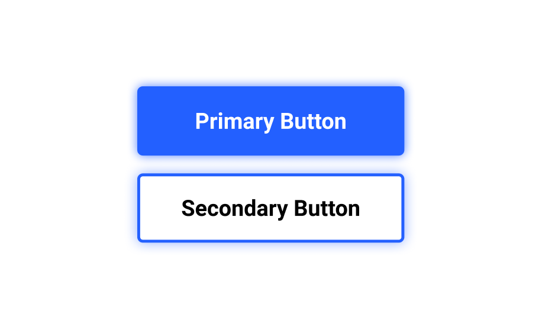
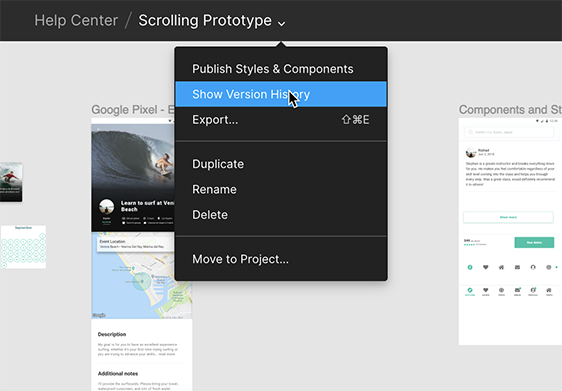

## Cos'è Figma?

Figma fondamentalmente è un **"tool per sviluppare grafica"**.

Può essere usato per gli utilizzi più disparati: biglietti da visita, volantini, app, web design, software, vettoriali e tutto quello che si è da sempre fatto con tool come Illustrator, Sketch e altri.

**Ma Figma è soprattutto uno strumento online collaborativo per il design di interfacce.**

---

<video controls width="80%">
    <source src="./Hero_Animation_60fps.mp4" type="video/mp4">
    Sorry, your browser doesn't support embedded videos.
</video>

---

# Do for interface design what Google Docs did for text editing.
<cite>Dylan Field, founder Figma</cite>

---

## Figma funziona nel browser

Viene offerto come software as a service, non dipende dalla piattaforma come altri tool come Sketch o Principle che funzionano solo su Mac.

Si può utilizzare nel browser, loggandosi sul sito [figma.com](https://www.figma.com), oppure scaricando le desktop app presenti sia per Windows che per Mac.

---

## Components

**I componenti sono elementi dell'interfaccia che possono essere riutilizzati tra i uno o più progetti.** Aiutano a mantenere coerenza ed efficienza nei progetti, specialmente più strutturati.

Lo stesso componente può essere utilizzato in più posti contemporaneamente, ognuno con dimensioni diverse con modifiche e differenze locali (istanze del componente master).

Abbinati ai constraints (vincoli)... sono una bomba!

---

# Figma Aims To Be A GitHub For Designers
<cite>Articolo su Fast Company</cite>

[Link 🔗](https://www.fastcompany.com/3054382/figma-aims-to-be-a-github-for-designers)

---

## Version history

Proprio come una repo Git, con Figma si ha una cronologia delle modifiche e versioni dei files. Si possono visualizzare le versioni precedenti di un file e ripristinare o duplicare qualsiasi versione. Le versioni vengono salvate automaticamente e **basta un click per tornare "indietro nel tempo"** (il piano free 30 giorni) e recuperare file, componenti o interi progetti.

---

# After that first experience of sending a Figma link out and seeing others immediately jump in, there is no going back.
<cite>Bryan Haggerty, Sr. Design Manager at Twitter</cite>

---

## Parola d'ordine: collaborazione

**Figma facilita la condivisione del lavoro e dei progetti.**

Si può lavorare in tanti sullo stesso progetto nello stesso momento con librerie condivise, condividere i lavori, richiedere feedback, commentare in aree specifiche, dare accessi a copy e dev, per aggiornare testi o addirittura ispezionare il codice e salvare gli assets grafici.

---

## PRO

- Bassa curva di apprendimento, UI similare ad altri tool
- Componenti, stili, librerie
- Griglie e constraints
- Prototipazione
- Web API
- A me personalmente piace tantissimo il loro tono di voce e il loro branding!

## CONTRO

- Non ha plugin, Sketch si
- Non lo trovo perfetto per lavorare con i vettoriali
- Pricing non conveniente per tutti gli usi
- Bisogna essere online per usarlo

