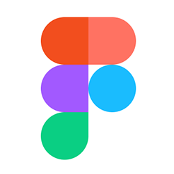

## Cos'è Figma?

Figma fondamentalmente è un **"tool per sviluppare grafica"**.

Può essere usato per gli utilizzi più disparati: biglietti da visita, volantini, app, web design, software, vettoriali e tutto quello che si è da sempre fatto con tool come Illustrator, Sketch e altri.

**Ma Figma è soprattutto uno strumento online collaborativo per il design di interfacce.**

---

<video controls width="80%">
    <source src="./Hero_Animation_60fps.mp4" type="video/mp4">
    Sorry, your browser doesn't support embedded videos.
</video>

---

# Do for interface design what Google Docs did for text editing.
<cite>Dylan Field, founder Figma</cite>

---

## Figma funziona nel browser

Viene offerto come Saas, non dipende dalla piattaforma come altri tool come Sketch o Principle che funzionano solo su Mac.

Si può utilizzare nel browser, loggandosi sul sito [figma.com](https://www.figma.com), oppure scaricando le desktop app presenti sia per Windows che per Mac.

---

# Figma Aims To Be A GitHub For Designers
<cite>Articolo su Fast Company</cite>

[Link 🔗](https://www.fastcompany.com/3054382/figma-aims-to-be-a-github-for-designers)

---
