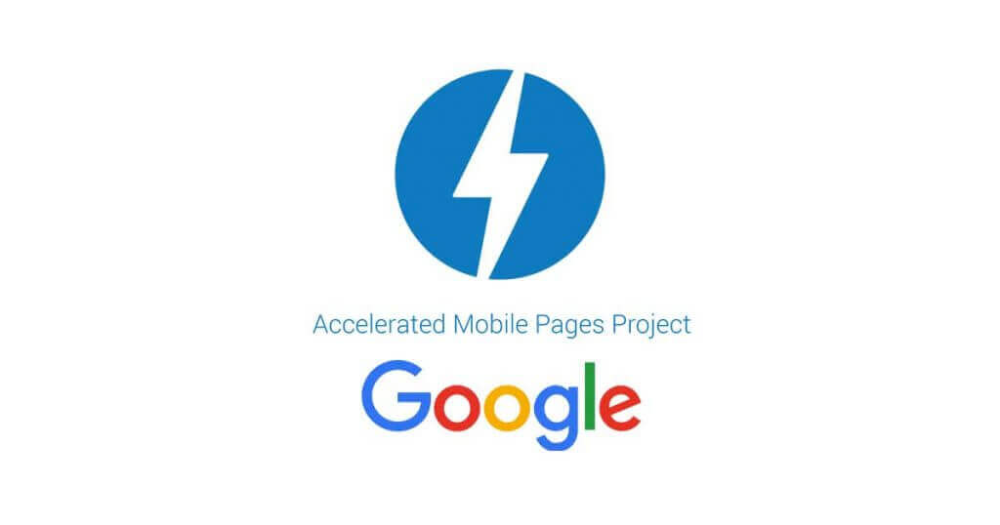

[ampproject.org](http://ampproject.org/)

---

##Timeline

- Oct 7, 2015. Announcement by Google!  
(European Digital News Initiative and partners) 

- Feb 2016. First AMP page! (Top stories)  
Sep 2016. Main mobile search results area + Bing.

- May 2017. 900k domains. 2Bn AMP pages published globally.

- June 2017. Twitter iOS/Android apps target AMPs. 

- Sep 2018. Microsoft (Bing) AMP viewer + AMP cache.