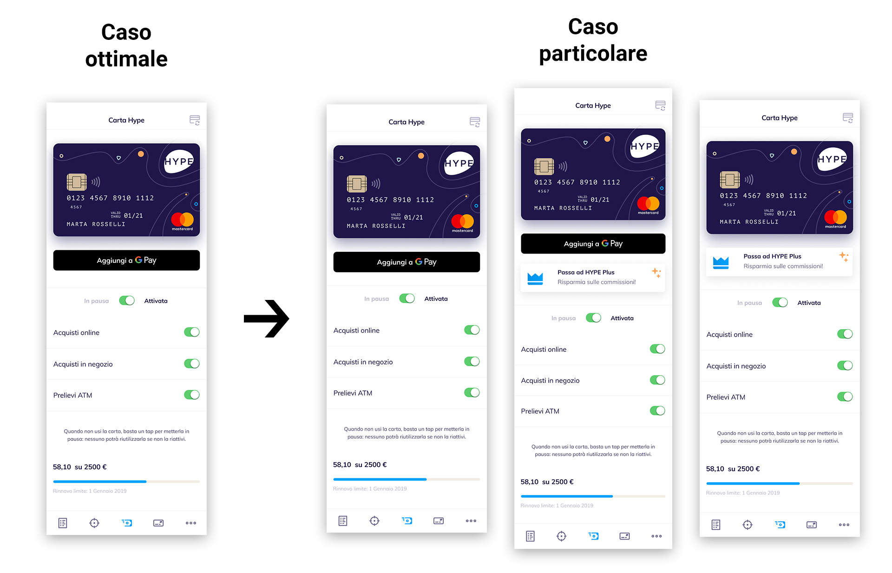
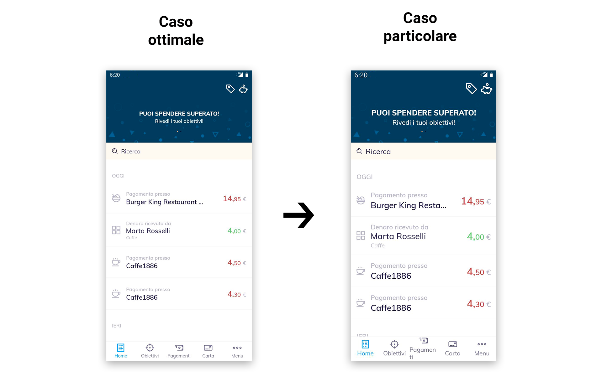
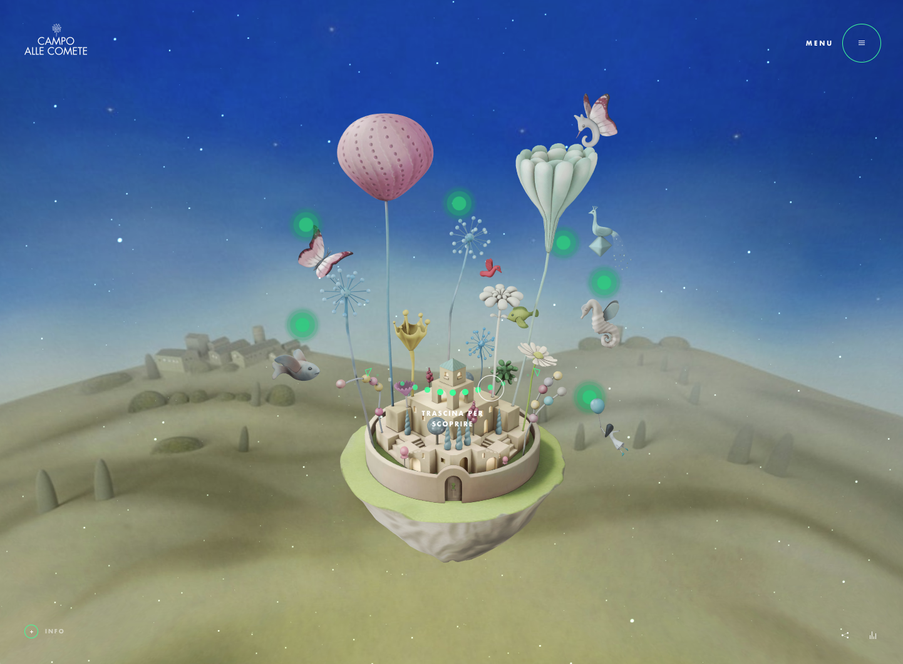
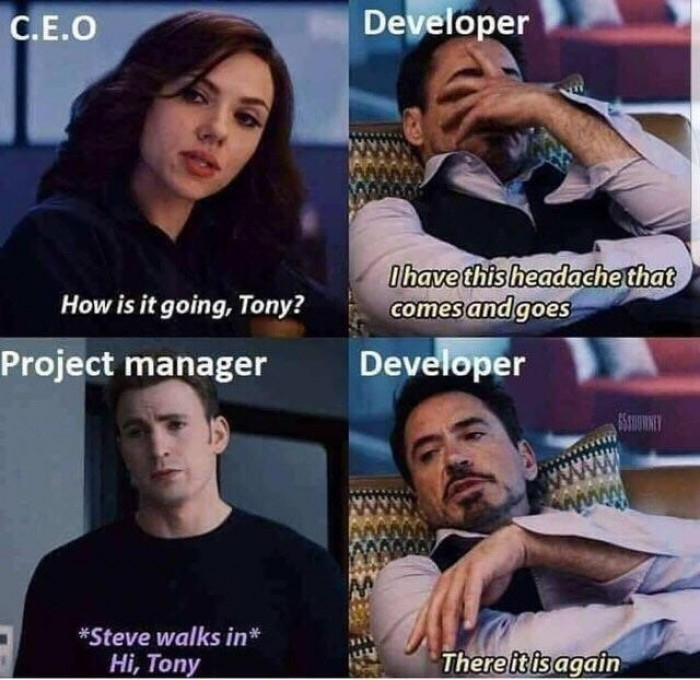

# I designer lavorano per casi ottimali, i developer per casi particolari.
<cite>Angelo Moroni</cite>

---

---

---

<big>❓</big>
## Perché succede?

Problema intrinseco del lavoro stesso: i designer hanno il compito di mostrare al cliente, PM o capo che sia, il design finale allo stato dell'arte. **Il "desiderato"**.

Quindi a volte si pensa più a quanto una soluzione sia bella, senza pensare al "becero" lavoro dei developer che devono avere a che fare con tutta una seria di limitazioni e condizioni.

---

Tutto bello, tutto figo. 
Un design web può essere fighissimo ma bisogna tenere conto delle performance e delle tecnologie necessarie per poterlo realizzare.

---

## Cosa pensa un developer?

- i designer sono troppo “pixel perfect”, nel progettare così come nel pensare 😜
- il processo creativo è un problema: un designer oggi progetta una sezione di un sito o un’app in un certo modo, poi si sveglia il giorno dopo e stravolge completamente quanto già , quasi in loop
- non è semplice far emergere i vincoli imposti dallo sviluppo (server, linguaggi di programmazione, etc…) verso chi si occupa di design o marketing

---

## Cosa pensa un designer?

- i developer sono stilisticamente ottusi 😘
- ma perché questi vogliono una Jira per tutto?
- non è semplice far capire quanto sia importante l'implementazione di un design system all'interno del progetto
- chi sviluppa non immagina la complessità implicita che sta dietro a un ragionamento di design (equilibro, tipografia, coerenza di pattern e di brand, usabilità, specifiche di contesto/piattaforma, tone of voice, interazioni, psicologia visiva, etc...)

---

# When designers do get more power than their developer counterparts, they build weaker products.
<cite>John Maeda, Design luminary</cite>

[Link 🔗](https://www.fastcompany.com/90320120/john-maeda-in-reality-design-is-not-that-important)
