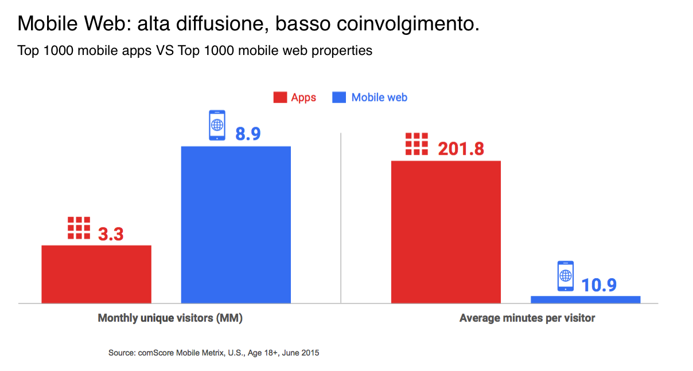
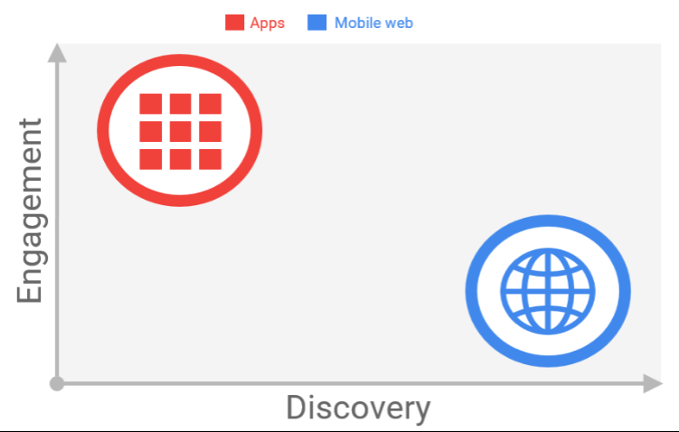
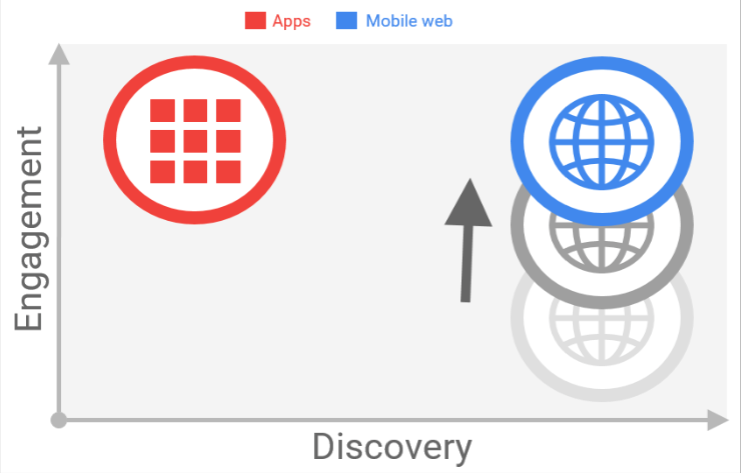

---

---

---

---

--- 

##Cosa sta succedendo?

- Il nostro focus principale è Mobile

- Il Mobile Web è "lento", spesso i siti non sono ottimizzati

- UX generalmente non all'altezza delle native apps 

 

##Performance as a feature

**40%** degli utenti abbandonano un sito che impiega più di  **3 secondi** per il suo caricamento.