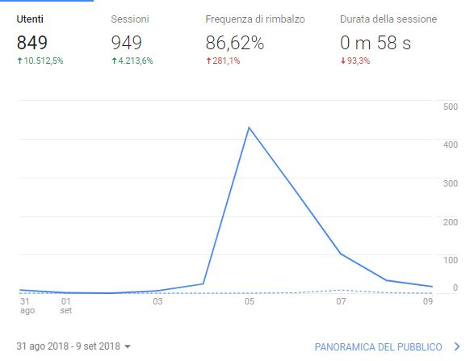

---

#Cos'è Product Hunt

PH è un sito internet che permette di scoprire e lanciare nuovi prodotti. 
Fondato dal 2013 da Rayan Hoover, ha preso parte al programma di accelerazione di YC. 
Al momento è una delle più grandi community di maker e startup presenti su internet

<figure class="box-shadow">

</figure>

---

#Come funziona Product Hunt

Su PH si può lanciare qualsiasi tipo di prodotto, sia prodotti finisci (si vedono molte pampagne crowfunding), che prodotti software.
Nella scheda di lancio di un prodotto ci sono due figure che sono fondamentali

<b>Maker(s)</b> 
Il/i maker/makers del prodotto, chi effettivamente ha sviluppato il prodotto.

<b>Hunter</b> 
Chi ha scoperto il prodotto, oppure un utente che fa da ambasador del prodotto.

---

Una volta che il prodotto viene pubblicato gli utenti possono inziare a upvotarlo (come su Reddit) 
Ogni giorno i prodotti più meritevoli (o con più upvotes) vengono segnati come featured e finiscono nella prima pagina

<figure class="box-shadow">

</figure>

<figure class="box-shadow">
    
</figure>

---

# Consigli pratici per lanciare su PH

---

## 1. Timing

Il Mercoledì il traffico è superiore agli altri giorni della settimana

<b>The new Product Hunt day starts at Midnight PST. (ore 9.00)</b>

<figure class="box-shadow">
    
</figure>

---

## 2. Community

Siate attivi nella community nei giorni precedenti al lancio, upvotate e commentate i prodotti degli altri

---

## 3. Preparate tutto il necessario

Preparate immagini, GIFs, link e promozioni speciali riservete a PH

Specialmente GIFs, la community di PH adora le GIF (soprattutto quelle con i gattini, ovvio no?)

<figure class="box-shadow">
    
</figure>

---

## 4. Preparate tagline, description e first comment

Fondamentale per il lancio è trovare

- Tagline (elevetor pitch)
- Descrizione (60 chars) 
- First comment (lunghezza infinita)

Raccontate una storia, non limitatevi a descrivere il prodotto

<figure class="box-shadow">
    
</figure>

---

## 5. Lanciate sui gruppi di PH

Nella community di PH ci sono vari gruppi (es. Makers Italy) 
Lanciate anche su questi gruppi!

---

## 6. Trovate un Hunter

Anche su PH come su altre piattaforme ci sono gli "Influencers" (es. Casey Naistat, anche di meno famosi)
se uno di loro fa da Hunter tutti i loro followers riceveranno una notifica.

Preparate un Hunter Kit (immagini, link descrizione) e contattateli per email o su PH.

<a href="https://500hunters.com/">500hunters</a>

<figure class="box-shadow">
    
</figure>

---

## 7. Seguite il lancio

Il giorno del lancio rispondere ai commenti e partecipate alle conversazioni!