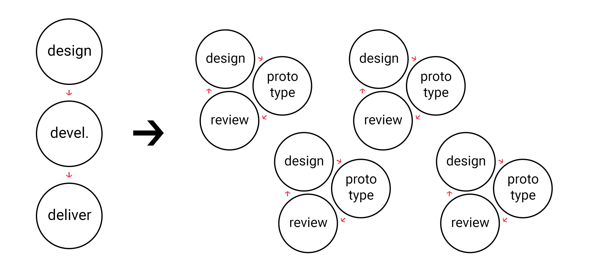
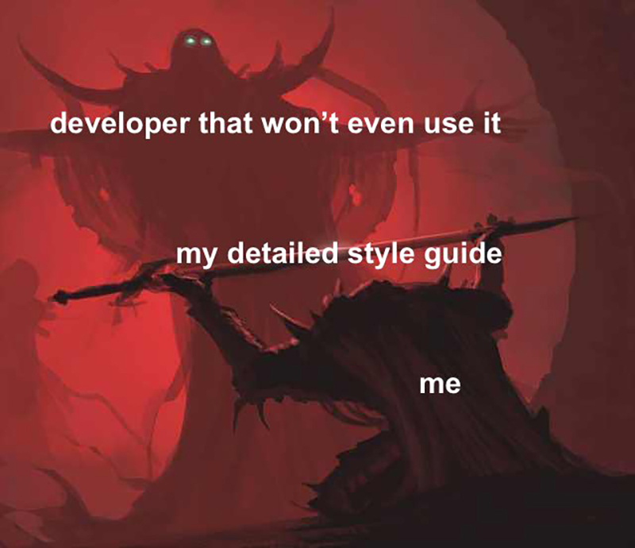

<big>❓</big>
## C'è una soluzione?

Entrambi i ruoli intraprendono sfide, entrambi vivono con un “processo creativo” sempre in atto in loro per migliorarsi e migliorare.

I punti di contatto quindi esistono... il workflow va aggiornato e va migliorata la comunicazione per risolvere i problemi e creare prodotti migliori!

---

# A prototype is worth a thousand meetings.
<cite>Mike Davidson, VP at [@InvisionApp](https://www.invisionapp.com/)</cite>

---

Il design, e i designer, oggi sono posti più in "alto" rispetto al development e ai developer. I prodotti necessitano di analisi tecniche, studio della UX, design, sviluppo con un ciclo continuo di revisioni.

---

## La nostra conclusione

- Mobile first: pensare sempre mobile first, sia nella progettazione di un sito, oltre che di un’app (già oggi il rapporto sul web si avvicina a 70/30)
- Creare design completi e pronti per lo sviluppo
- Progettare un sistema e non solo pagine (chi conosce il termine DLS?)
- Se possibile creare prototipi completi dell'app o sito web
- Comunicare... e immedesimarsi l'uno nell'altro

