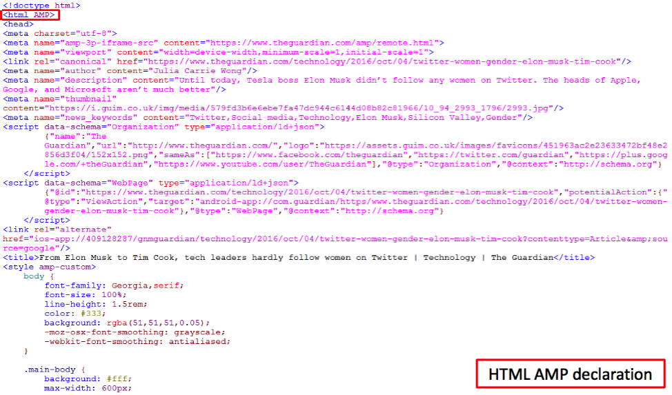
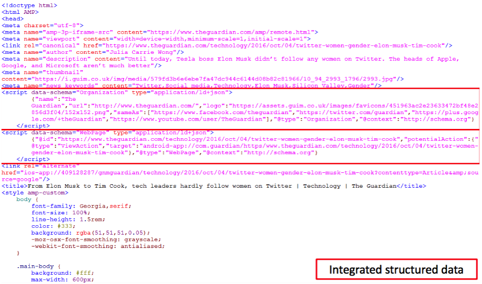
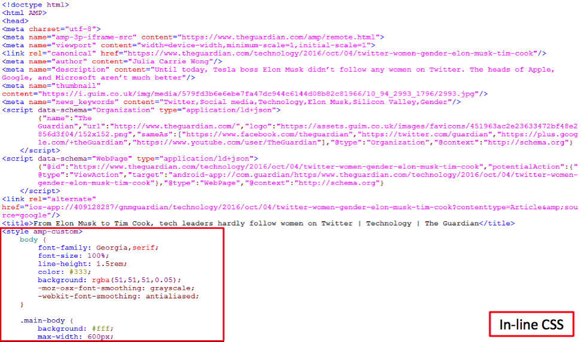
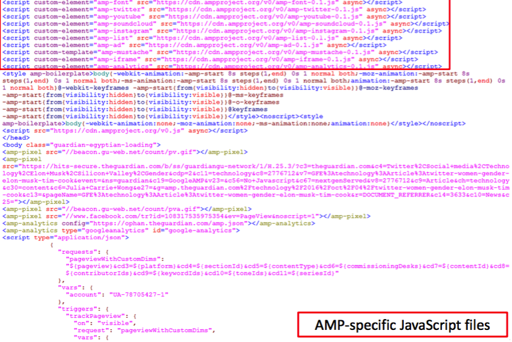
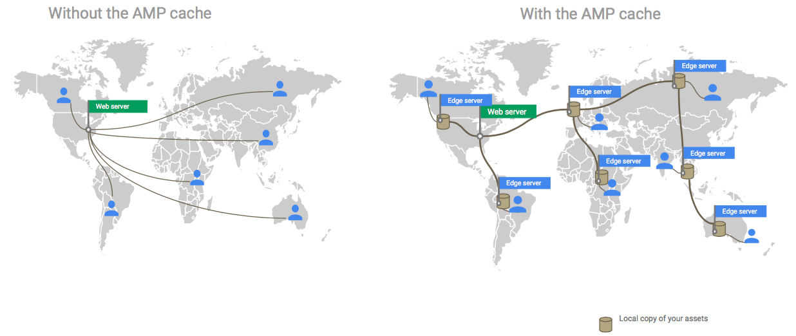
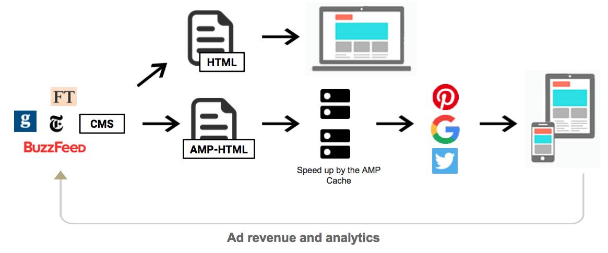

##Cos'è AMP?

<cite>"In human speak, AMP pages are WEB pages on a diet!"</cite>

  ( ͡° ͜ʖ ͡°)

---

---

---

---

HTML ⚡

---

Dati strutturati

---

CSS solo inline!

---

JS lib + Componenti

---

Global AMP Cache

---

HTML vs AMP-HTML

---

Pre-Rendering

