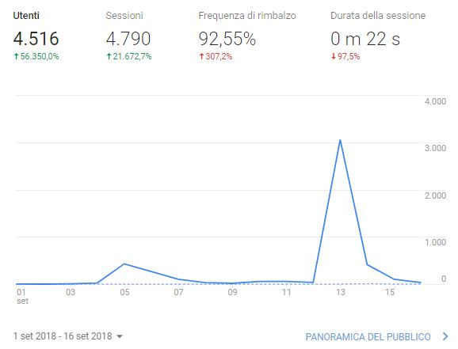

---

#Cos'è Hacker News

Hacker News è un sito di notizie social incentrato sull'informatica e l'imprenditorialità. 
È gestito dal fondo di investimento e incubatore di startup Paul Graham, Y Combinator. 

---

#Come lanciare su HN

HN è molto seguito in tutto il mondo, la sezione ShowHN è creata apposta per far vedere i propri progetti/prodotti. 
Ha un funzionamento molto simile a reddit, arrivare nella fornt page porta un traffico enorme (15-30k visite).

<figure class="box-shadow">

</figure>

---

## 1. Be relevant

Il pubblico di HN è formato principalemente da hackers e imprenditori. Cerca di attarli con un messaggio rilevante.

---

## 2. Don't be a salesperson

Non cercare di vendere il prodotto, discuti di come e perchè lo hai creato

---

## 3. Follow the thread

Partecipa alla discussione che si genera sotto il tuo post, rispondi a dubbi e chiarimenti.