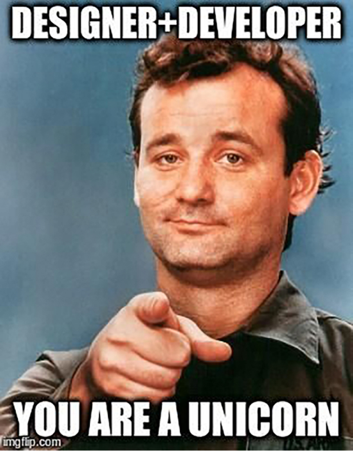

## Designer & Developer
Proprio a causa di questi “buchi” di comunicazione e preparazione, sia didattica che nei materiali, negli ultimi anni è nata una nuova figura, quella dello UX Engineer (UXE), un ruolo ibrido che colma lo spazio tra i due mondi, senza poter però sostituirsi a uno dei due.

**UX Design -> UX Engineer -> Dev & Ops**

---

# Let no man who is not a Mathematician read the elements of my work.
<cite>Leonardo Da Vinci</cite>

---

## Qualche link interessante:

[https://www.youtube.com/playlist?list=PLNYkxOF6rcIC60856GnLEV5GQXMxc9ByJ 🔗](https://www.youtube.com/playlist?list=PLNYkxOF6rcIC60856GnLEV5GQXMxc9ByJ)

[https://www.invisionapp.com/inside-design/becoming-a-designer-who-codes/ 🔗](https://www.invisionapp.com/inside-design/becoming-a-designer-who-codes/)

[https://www.fastcompany.com/90320120/john-maeda-in-reality-design-is-not-that-important 🔗](https://www.fastcompany.com/90320120/john-maeda-in-reality-design-is-not-that-important)

---
