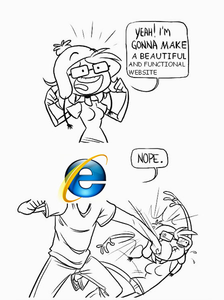
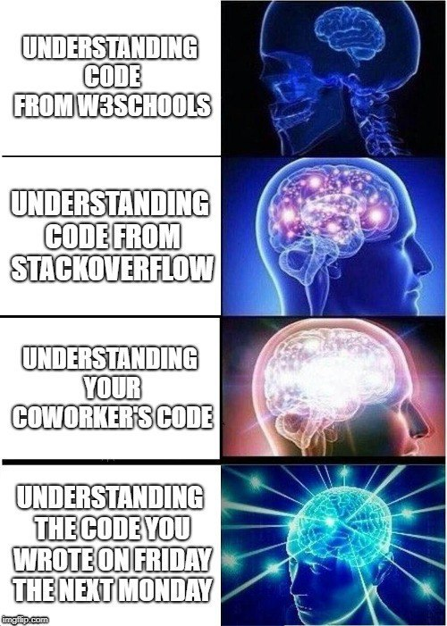

## Become a Unicorn
Proprio a causa di questi “buchi” di comunicazione e preparazione, sia didattica che nei materiali, negli ultimi anni è nata una nuova figura, quella dello UX Engineer (UXE), un ruolo ibrido che colma lo spazio tra i due mondi, senza poter però sostituirsi a uno dei due.

Un annuncio di Google per questa figura cita: <i>"As a UX Engineer, you’ll weave together strong design aesthetics with technical know-how"</i>. 
[https://design.google/jobs/ux-engineer/ 🔗](https://design.google/jobs/ux-engineer/)

**UX Design -> UX Engineer -> Dev & Ops**

---

# Let no man who is not a Mathematician read the elements of my work.
<cite>Leonardo Da Vinci</cite>

---

---

## Qualche link interessante:

[https://www.youtube.com/playlist?list=PLNYkxOF6rcIC60856GnLEV5GQXMxc9ByJ 🔗](https://www.youtube.com/playlist?list=PLNYkxOF6rcIC60856GnLEV5GQXMxc9ByJ)

[https://www.invisionapp.com/inside-design/becoming-a-designer-who-codes/ 🔗](https://www.invisionapp.com/inside-design/becoming-a-designer-who-codes/)

[https://www.fastcompany.com/90320120/john-maeda-in-reality-design-is-not-that-important 🔗](https://www.fastcompany.com/90320120/john-maeda-in-reality-design-is-not-that-important)

[https://design.google/library/john-maeda-interview-new-design-religion/ 🔗](https://design.google/library/john-maeda-interview-new-design-religion/)

[https://uxengineer.com/skills-needed-become-a-ux-engineer/ 🔗](https://uxengineer.com/skills-needed-become-a-ux-engineer/)

# Grazie!
