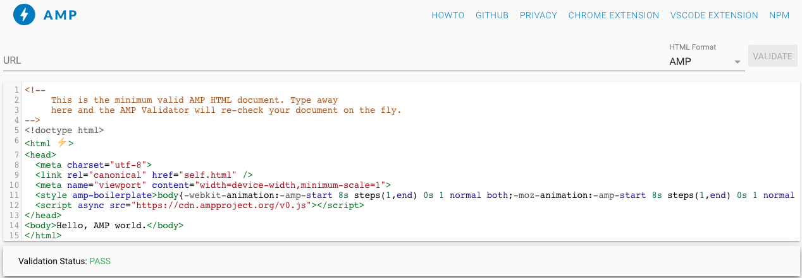
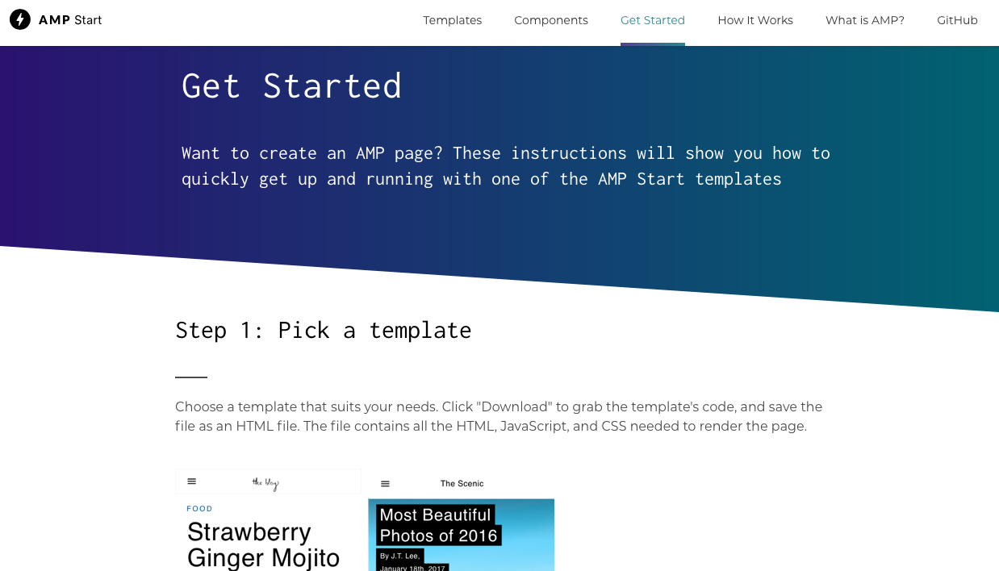
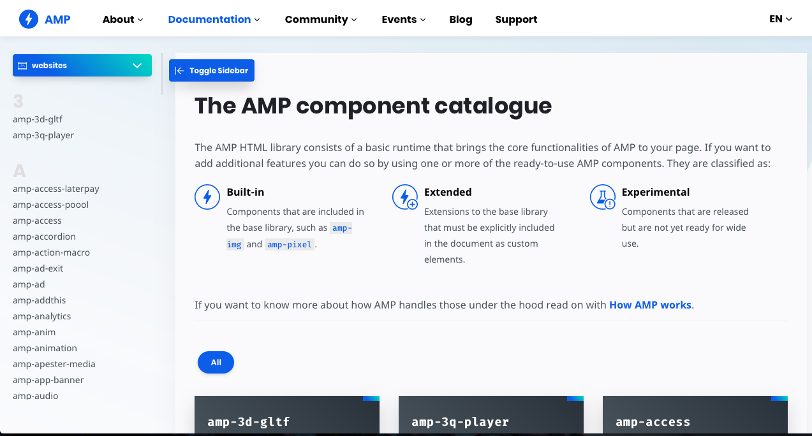
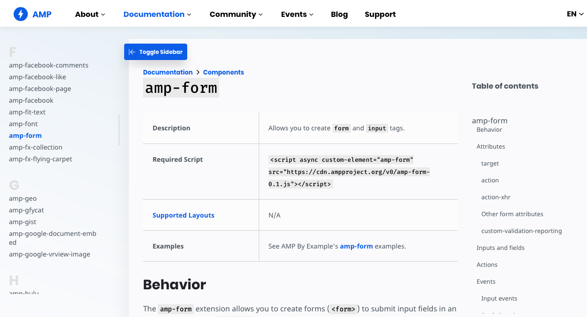
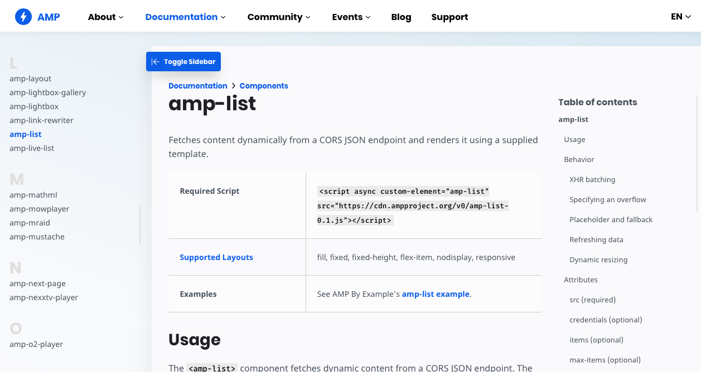
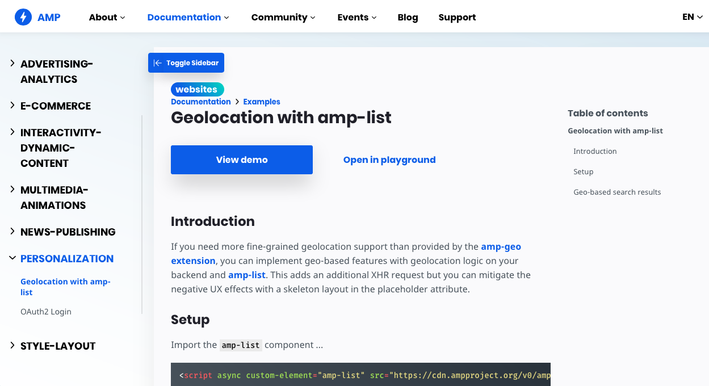
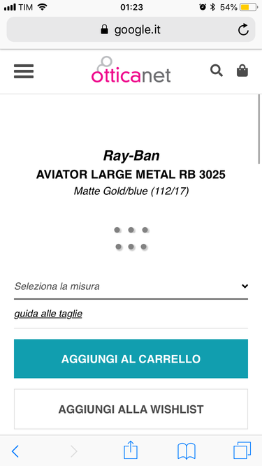
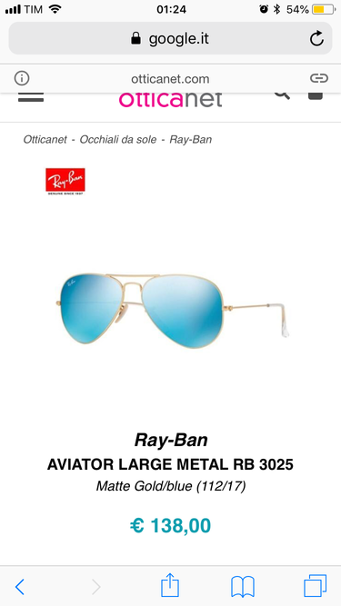
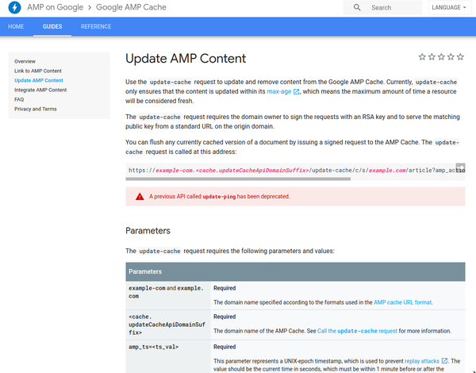

###Da dove iniziare?

[AMP Validator](https://validator.ampproject.org)

---

###AMP Start

[https://www.ampstart.com/getstarted](https://www.ampstart.com/getstarted)

---

#E come faccio senza JS?!

---

### AMP Components!

--- 

--- 

--- 

###Geolocation con amp-list

---

--- 

###Purge!

---

###RTFM

- [https://amp.dev/](https://amp.dev/)
- [https://twitter.com/amphtml](https://twitter.com/amphtml)
- [https://ampbyexample.com](https://ampbyexample.com)
- [https://developers.google.com/amp/cache/](https://developers.google.com/amp/cache/)
- [https://github.com/ampproject/amphtml](https://github.com/ampproject/amphtml)
- [https://groups.google.com/forum/#!forum/amphtml-discuss](https://groups.google.com/forum/#!forum/amphtml-discuss)
- [https://stackoverflow.com/questions/tagged/amp-html](https://stackoverflow.com/questions/tagged/amp-html)