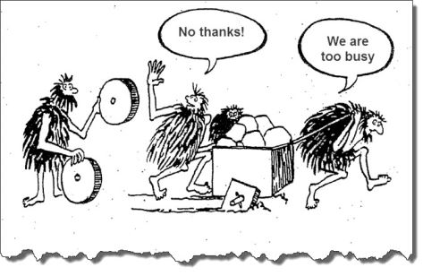

# Efficient Developer

Project development best practices

---

# NO EXCUSES!

---

## Cosa vuol dire essere un Efficient Developer?

- Introdurre tools e metodologie che incrementano la qualità del lavoro prodotto
- Diminuire il tempo dedicato alla risoluzione di bug e al reperire informazioni
- Limitare i "single points of failure"
- Avere il totale controllo del codice e dei progetti
- Rimanere in continuo aggiornamento personale
- Tempo investito oggi = Efficienza guadagnata domani

---

## Caratteristiche

* Creazione del Mindset
* Architettura dei progetti
* Workflow dei processi di sviluppo