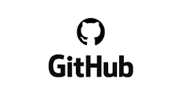

# Efficient Developer

Project development best practices

---

# NO EXCUSES!

---

## Cosa vuol dire essere un Efficient Developer?

- Introdurre tools e metodologie che incrementano la qualità del lavoro prodotto
- Diminuire il tempo dedicato alla risoluzione di bug e al reperire informazioni
- Limitare i "single point of failure"
- Avere il totale controllo del codice e dei progetti
- Rimanere in continuo aggiornamento personale
- Tempo investito oggi = Efficienza guadagnata domani

---

# Mindset

---

# Architettura dei progetti

---

# Git Repositories

---

# Git Repositories

- sistema di versionamento dei progetti
- agevolare il lavoro in team
- costituisce un backup naturale
- permettere di creare automatismi sul progetto (tests, build)

---
## Documentazione

# Project Wiki

- fornire memoria storica sul progetto (facendo risparmiare tempo)
- facilitare l'inserimento di nuove risorse

---
## Documentazione

# Checklist

- documentare processi di sviluppo e di intervento
- facilitare il processo di onboarding

---
## Documentazione

# Api Documentation

- Documentare il flusso dati tra backend e frontend
- Tempo di trasferimento delle nozioni azzerato

---
## Documentazione

# Code Documentation

- Facilitare la manutenzione del codice
- Fornire immediatamente il contesto logico

---

# TESTS

- Rendere il codice stabile nel tempo
- Favorire l'analisi delle specifiche
- Permettere l'emergere di altri bug nascosti

---
## Tests

# End to End tests

- Simulare l'attività dell'utente
- Permettere di verificare la stabilità della UX
- Permettere di esaminare le situazioni di errore

---
## Tests

# Unit tests

- Verificare la stabilità dei metodi
- Permettere uno sviluppo TEST-DRIVEN
- Assicurare la coerenza dei dati

---

# Pull-Requests & Code Reviews

- Responsabilizzare i membri del team
- Assicurare un doppio controllo sul codice
- Garantire una coerenza della code-base
  
---

# Continuous Integration

- Automatizzare i controlli sul progetto (tests) ad ogni aggiornamento
- Non permettere il merge di codice con conflitti o test non superati
- Incoraggiare i developer ad effettuare commit continui

---

# Docker

- Ambiente virtuale di sviluppo
- Uniformare ambiente sviluppo / produzione
- Rimuovere la necessità di installare librerie o ambienti (ex. XAMP)
- Evitare problemi di versioni, aggiornamenti

---

# GRAZIE A TUTTI!

