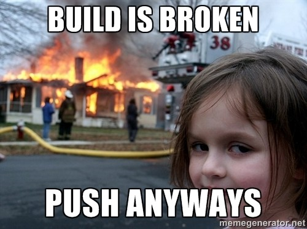

# WORKFLOW

---

# Pull-Requests & Code Reviews

- Responsabilizzare i membri del team
- Assicurare un doppio controllo sul codice
- Garantire una coerenza della code-base

---

# Continuous Integration

- Automatizzare i controlli sul progetto (tests) ad ogni aggiornamento
- Non permettere il merge di codice con conflitti o test non superati
- Incoraggiare i developer ad effettuare commit continui

---

# Docker

- Ambiente virtuale di sviluppo
- Uniformare ambiente sviluppo / produzione
- Rimuovere la necessità di installare librerie o ambienti (ex. XAMP)
- Evitare problemi di versioni, aggiornamenti